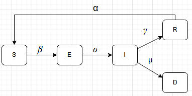

# Impactos da perda de imunidade na mortalidade. Uma análise com modelo compartimental

[](https://github.com/biguelito/CompartmentalModels/blob/main/Modelo_compartimental.pdf)

## O projeto

Este projeto tem como objetivo implementar modelos compartimentais e realizar um estudo sobre o que foi implementado. Foram implementados 4 modelos compartimentais para entendimento da modelagem e uso destes modelos.

### O modelo SEIRSD

Para o estudo foi utilizado o modelo SEIRSD, um modelo que possui 5 compartimentos, Suscetiveis, Expostos, Infectados, Recuperados e Mortos, que se interagem através das taxas: Taxa de infecção, beta; taxa de incubação, sigma; taxa de recuperação, gamma; taxa de mortalidade, mu e taxa de perda de imunidade, alfa.



Este modelo, assim como é um modelo compartimental, tem como objetivo simular o comportamento de uma doença em uma população. Essa simulação é feita calculando a quantidade de individuos dos compartimentos com o passar do tempo estipulado para a simulação. Cada compartimento é representado matematicamente por uma EDO, como o modelo é composto de multiplos compartimentos, isso resulta em um sistema de EDOs. Estas são as EDOs deste modelo.

$$
\frac{dS}{dt} = -\beta \cdot I \cdot \frac{S}{N} + \alpha \cdot R
$$

$$
\frac{dE}{dt} = \beta \cdot I \cdot \frac{S}{N} - \sigma \cdot E
$$

$$
\frac{dI}{dt} = \sigma \cdot E - \gamma \cdot I - \mu \cdot I
$$

$$
\frac{dR}{dt} = \gamma \cdot I - \alpha \cdot R
$$

$$
\frac{dD}{dt} = \mu \cdot I
$$


### O estudo

O estudo realizado busca analisar o impacto da perda de imunidade na mortalidade de uma doença. Por isso, para poder comparar a variação da perda de imunidade com o número de mortos, foi utilizado um modelo compartimental que abordasse os 2 conceitos. Para realizar o estudo, foram comparados cenários de simulação do modelo com taxas pré definidas para as taxas que não a de perda de imunidade e depois esses cenários foram refeitos utilizando o método estatistico de Monte Carlo. As conclusões podem ser vistas no texto [Modelo_compartimental.pdf](https://github.com/biguelito/CompartmentalModels/blob/main/Modelo_compartimental.pdf)


## Arquitetura do repositório

O repositório está organizado, numa visão simplificada, na seguinte arquitetura


```
.
├── compartmentals/             # Classes para tratar um modelo. Realizam a simulação do modelo e geram a visualização
├── models/                     # Modelos implementados. Possui o nome dos compartimentos, as variaveis das taxas, valores defaults e as EDOS do modelo
│   └── figures/                # Figuras que representam visualmente cada modelo
├── notebooks/                  # Carderno utilizado para testar implementação de abordagens
├── pages/                      # Paginas do streamlit para renderizar os modelos, sua descrição e sua visualização. Possui também uma pagina referente aos metodos do Scientific Report
├── Modelo_compartimental.pdf   # PDF do trabalho escrito com formatação Scientific Report
└── requirements.txt            # Lista de dependências do Python

```

## Instalação e utilização

### Localmente

1. **Configuração do ambiente**: Para garantir que o python que irá rodar o projeto possui todas as dependencias necessarias, é possivel criar um ambiente virtual e instalar nele as libs necessárias. Essas estão listadas no `requirements.txt`.

    Criando o ambiente
    ```bash
    python3 -m venv venv
    ```
    Ativando o ambiente:
    - No Windows:
    ``` 
    venv\Scripts\activate
    ```
    - No macOS/Linux:
    ``` 
    source venv/bin/activate
    ```

2. **Instalação de libs**: Com o ambiente criado, basta instalar as libs do `requirements.txt`.
    ```bash
    pip3 install -r requirements.txt
    ```

### Remotamente 

1. **Streamlit**: Outro meio de utilizar o projeto é acessar a interface já criada, acessível no [Streamlit](https://epidemiology-compartmentalmodels.streamlit.app/)

---

**Licença:** Este projeto é distribuído sob a Licença MIT.